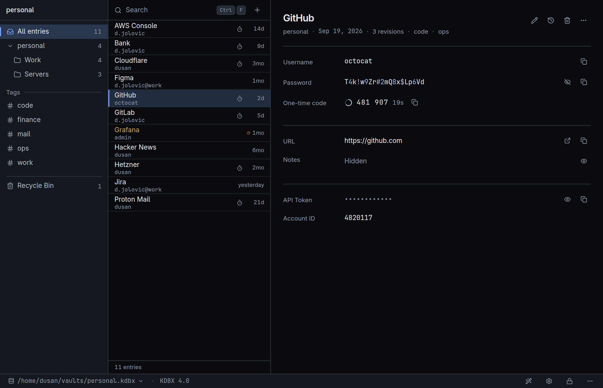
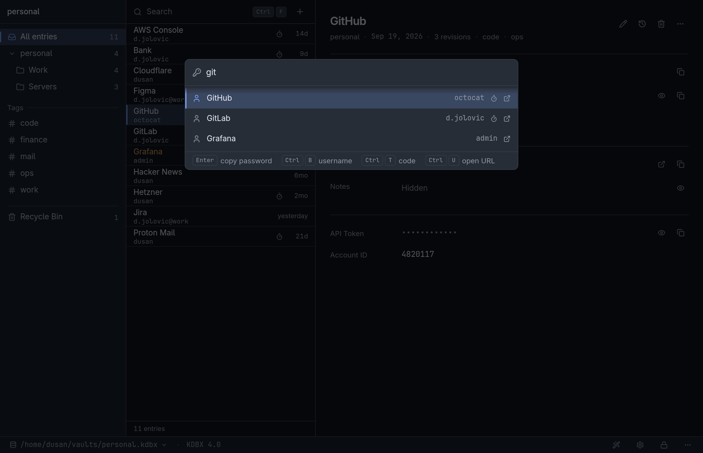
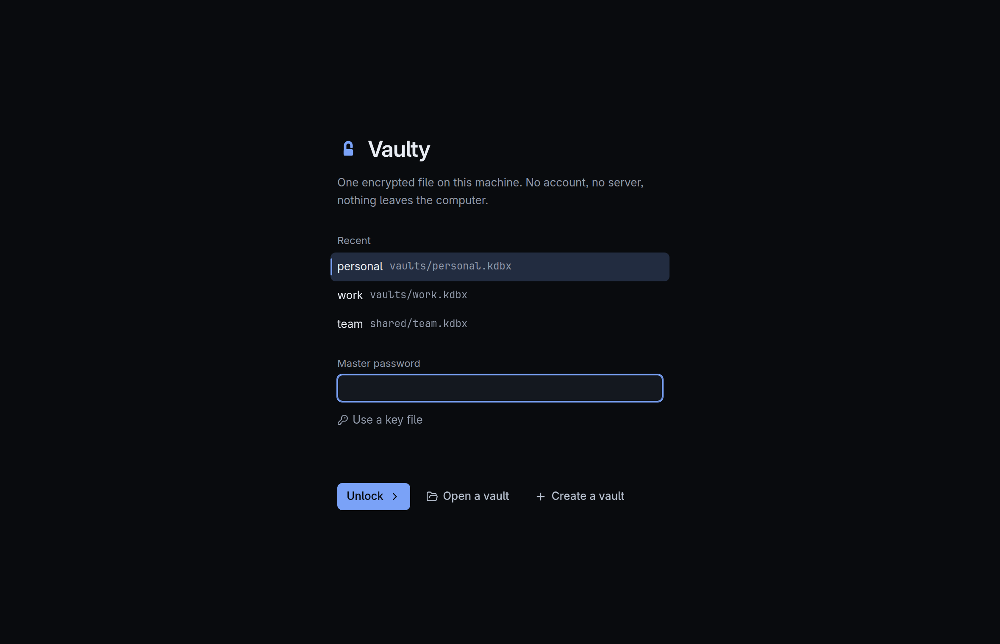
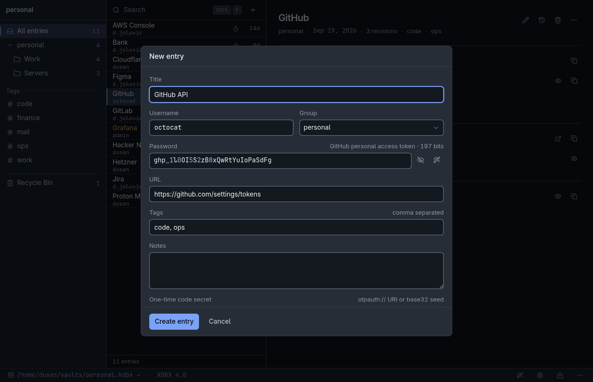
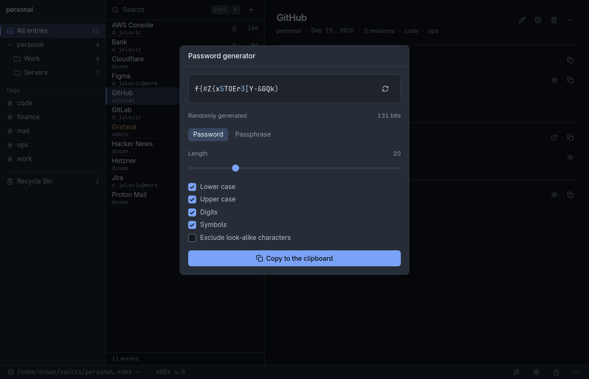
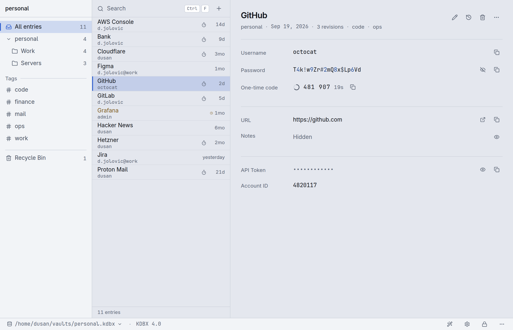

<h1 align="center">Vaulty</h1>

<p align="center">
  <strong>An offline, open source password manager for Windows and Linux.</strong><br>
  One encrypted KeePass file on your own disk. No account, no cloud, no telemetry.
</p>

<p align="center">
  <a href="https://github.com/jolovicdev/vaulty/actions/workflows/ci.yml"></a>
  <a href="LICENSE"></a>
  
  
</p>

<p align="center">
  
</p>

Vaulty keeps your passwords in a single encrypted KDBX file, the format
KeePass and KeePassXC use, so the vault is never tied to this program.
KeePassXC opens anything Vaulty writes, and Vaulty opens the KDBX 3.1 and
KDBX 4 vaults KeePassXC made. There is no account to create and no server
behind it. To use a vault on two machines, keep the file in Syncthing or any
other sync folder: Vaulty notices when another machine changed it and offers
to merge.

It is a small desktop app written in Go with [Wails](https://wails.io), and
it is built around the keyboard. `Ctrl K` opens a command palette, you type a
few letters, and `Enter` copies the password.

## Features

- Opens and saves KeePass vaults (KDBX 3.1 and 4) with a master password, a
  key file, or both
- Command palette and fuzzy search across titles, usernames, URLs and tags
- One-time codes (TOTP) with a countdown, read from the same field KeePassXC
  uses
- Password and passphrase generator backed by `crypto/rand` and the EFF word
  list
- Custom fields, tags, notes, entry history with restore, and a recycle bin
  KeePassXC recognises as its own
- Saves every change by itself, atomically, and keeps five rolling backups
  beside the vault
- Clears a copied password from the clipboard after 15 seconds and keeps it
  out of Windows Clipboard History
- Locks itself after five minutes idle
- Light and dark themes that follow the OS
- A single portable `.exe` on Windows, no installer

The strength meter grades a password you chose and only describes one you
were issued. Paste a GitHub token and it reads `GitHub personal access token
· 197 bits` instead of showing a green bar, because there is nothing you
could do with a grade. It knows 23 token formats.

## Screenshots

|  |  |
|---|---|
| The command palette on `Ctrl K` | The unlock screen |
|  |  |
| A pasted token, described rather than graded | The generator on `Ctrl G` |



## Keyboard shortcuts

| Keys | Action | Keys | Action |
|---|---|---|---|
| `Ctrl K` | Command palette | `Ctrl N` | New entry |
| `Ctrl F` | Search | `Ctrl E` | Edit entry |
| `Ctrl C` | Copy password | `Ctrl H` | Entry history |
| `Ctrl B` | Copy username | `Ctrl G` | Password generator |
| `Ctrl T` | Copy one-time code | `Ctrl O` | Open another vault |
| `Ctrl U` | Open URL | `Ctrl L` | Lock |
| `Ctrl R` | Reveal password | `Ctrl ,` | Settings |

Every action is also in the right-click menus and the footer, and
`Ctrl Shift /` lists all the bindings.

## Install

Download the [latest release](https://github.com/jolovicdev/vaulty/releases/latest).
Each one is built from its tag by
[a workflow in this repository](.github/workflows/release.yml), and
`SHA256SUMS` sits beside the binaries:

```sh
sha256sum -c SHA256SUMS --ignore-missing
```

**Windows.** `vaulty-windows-amd64.exe` is portable. There is no installer,
settings live in `%APPDATA%\vaulty\settings.json`, and nothing else is written
outside the vault's own folder. It needs the WebView2 runtime, which Windows 11
already has; if it is missing, Vaulty says so instead of downloading it. The
executable is not code signed, so SmartScreen asks once: More info, then Run
anyway.

**Linux.** `vaulty-linux-amd64` needs WebKitGTK 4.1 (`libwebkit2gtk-4.1-0` on
Debian and Ubuntu) and, for copying, `wl-copy` on Wayland or `xclip`/`xsel` on
X11.

```sh
chmod +x vaulty-linux-amd64 && ./vaulty-linux-amd64
```

### Build from source

```sh
sudo apt install libgtk-3-dev libwebkit2gtk-4.1-dev   # Linux only
make deps      # npm ci in frontend/
make build     # build/bin/vaulty
make check     # tests and linters
```

The `webkit2_41` build tag selects WebKitGTK 4.1; drop it on a distribution
that only ships 4.0. `make build-windows` cross-compiles the portable
`build/bin/vaulty.exe` with its icon. It uses the Wails CLI, which
`make tools` installs, and `make build-windows-bare` is the fallback without
it.

## KeePassXC compatibility

The test suite drives the real `keepassxc-cli` to check that KeePassXC reads
what Vaulty writes: all four fixture formats, protected custom fields, matching
TOTP codes and the shared recycle bin. The other direction is covered by a
vault that KeePassXC created, committed as a fixture.

```sh
make test-interop
VAULTY_KEEPASSXC=/usr/bin/keepassxc-cli make test-interop   # explicit path
```

One check stays manual, because `keepassxc-cli` only writes KDBX 3.1: create a
KDBX 4 database in the KeePassXC GUI with a protected custom field and a TOTP
secret, open and edit it in Vaulty, then open it in KeePassXC again.

A KDBX 4 vault whose key derivation is set to Argon2id does not open.
gokeepasslib derives keys with Argon2d or AES-KDF only, so the file is
reported as a wrong password. In KeePassXC the setting is under Database
Settings, Encryption.

## Security

The vault is a standard KDBX file. A vault created here derives its key with
Argon2d at 64 MiB and ten passes and is encrypted with ChaCha20, with an HMAC
over the header; one made elsewhere keeps the settings it came with. Vaulty
implements no cryptography of its own: the format handling is
[gokeepasslib](https://github.com/tobischo/gokeepasslib) and the primitives
are the Go standard library.

Vaulty makes no network requests. There is no telemetry and no update check,
the interface runs under a Content Security Policy that allows no remote
origin, and the fonts and assets are compiled into the binary. The entry list
the interface holds never contains a password, a note or a protected field.
Revealing one fetches that single field, and copying a stored secret happens
on the Go side, so it never passes through the webview.

Saves are atomic: the vault is written to a temporary file, flushed, then
renamed over the original, so a crash cannot leave half a vault. Five backups
are kept beside it, each the file as a session found it before its first save.
If something else changed the file, a sync client or KeePassXC, Vaulty refuses
to overwrite it and offers to reload, save a copy or merge. Locking drops the
open database and its keys.

To report a problem, see [SECURITY.md](SECURITY.md).

## What it doesn't do

Browser integration and autofill, auto-type, attachments, importers, passkeys,
plugins, mobile apps, a sync service, several vaults open at once, or locking
when the OS session locks. KeePassXC has several of these and opens the same
file, so the two work side by side.

## Development

```
main.go                  Wails setup: window, CSP, embedded assets
app.go                   Binding layer; session state behind a mutex
internal/vault           KDBX open, list, reveal, edit, save, merge
internal/clipboard       Per-OS clipboard with a timed clear
internal/generator       crypto/rand passwords and EFF passphrases
internal/totp            otpauth URIs and RFC 6238 codes
internal/settings        JSON preferences in the OS config dir. No secrets
internal/strength        Pattern-based guess estimate
frontend/src/styles      Design tokens, then everything built from them
frontend/src/lib/api.ts  The only module that touches the Wails bridge
```

`internal/vault` has no Wails import and is tested entirely from `go test`,
with fixtures in KDBX 3.1 and 4, with and without a key file. `make check` is
what CI runs, and `make help` lists every target.

## Licence

MIT, see [LICENSE](LICENSE). The bundled fonts, the EFF word list and the
dependencies are listed in [THIRD-PARTY.md](THIRD-PARTY.md).
